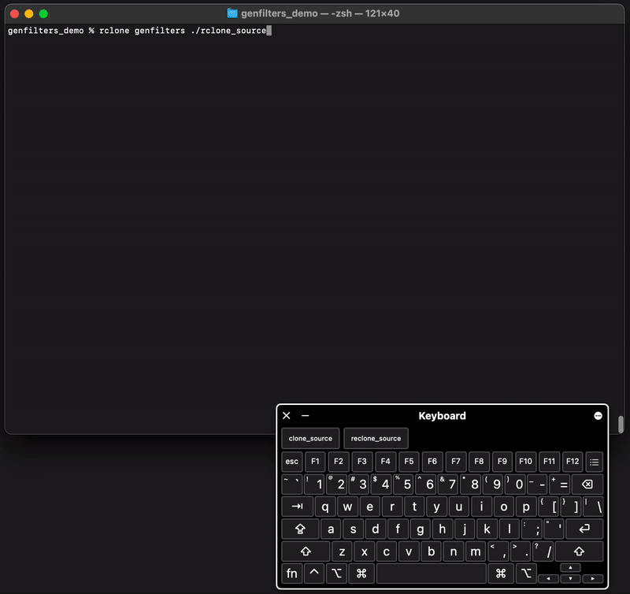

# Genfilters: Interactive Filter Generator for Rclone

Genfilters is an interactive, automatic filter generator for [rclone](https://rclone.org/). It works with any rclone remote, and at the end it spits out a file that can be used as a [`--filter-from`](https://rclone.org/filtering/#filter-from-read-filtering-patterns-from-a-file) file (or bisync [`--filters-file`](https://rclone.org/bisync/#filtering)).



This initial implementation is simply a fork of [rclone](https://github.com/rclone/rclone) with `genfilters` added as an extra command.
Usage examples:

```
rclone genfilters /some/local/folder
```
```
rclone genfilters drive:some/remote/folder -o /some/custom/path/for/myfilters.txt --regex --cmd
```

## Installation

See [downloads](https://github.com/nielash/rclone-genfilters/releases) or [install from source](https://rclone.org/install/#source).

## Synopsis

Genfilters is an interactive, automatic filter generator for rclone. It works
with any rclone remote, and at the end it spits out a file that can be used as
a [`--filter-from`](https://rclone.org/filtering/#filter-from-read-filtering-patterns-from-a-file) file
(or bisync [`--filters-file`](https://rclone.org/bisync/#filtering)).

Supports both `- **` and `+ **` modes, and can also dump
filters as regex, and it is careful about the rule order and avoiding
redundancy. It all runs through rclone's actual filter module in realtime, so
you can see exactly what you're getting.

Directories are traversed only when they are 'expanded', so it is easy to use
even with large remotes.

It can also show the filters in command line syntax, to add the filters
directly via the [`--filter`](https://rclone.org/filtering/#filter-add-a-file-filtering-rule)
flag instead of with a `--filter-from` file.

You can interact with the user interface using key presses. The supported keys are:

     ↑,↓ or k,j to Move up and down the tree
     ←,→ to include/exclude the current node
     return to expand/collapse the currently selected directory
     x enable 'exclude others' mode (- **)
     i enable 'include others' mode (+ **) (enabled by default)
     d toggle debug mode (shows more info)
     r toggle showing the rules to the right of the tree
     c clear selections and start over
     y copy current relative path to clipboard (if supported)
     Y copy current absolute path to clipboard (if supported)
     q/ESC/^c to quit and output final results

See flags for more options.

Example usage of output file:

	rclone tree remote:path --filter-from "/path/to/your/rclone_genfilters.txt"


```
rclone genfilters remote:path [flags]
```

## Options

```
      --cmd                  Also show filters in command line syntax, to add the filters directly via the --filter flag instead of with a --filter-from file
  -h, --help                 help for genfilters
      --input-file string    Load filters from this existing file on startup.
      --no-open              Do not automatically open the file when completed.
  -o, --output-file string   Write results to a file at this path, for use as a --filter-from file. (default: {currentdirectory}/rclone_genfilters.txt)
      --regex                Also show output as regex, in --dump filters format
```